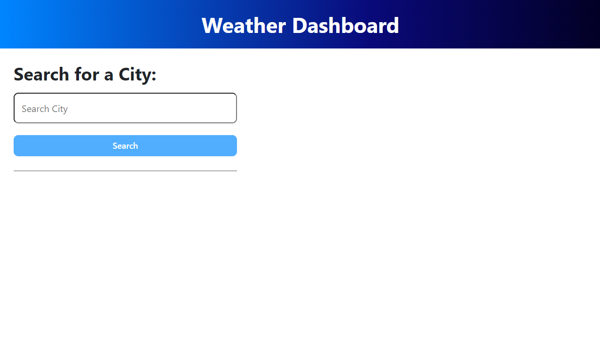
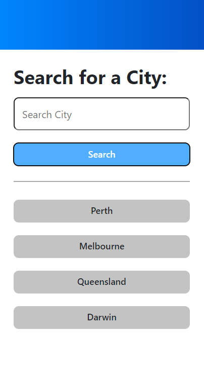
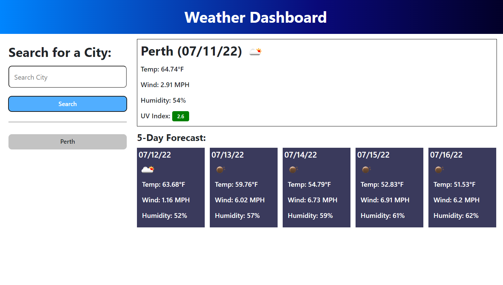

# Weather-Dashboard

## Description

The following weather dashboard application allows a user to see the weather outlook for multiple cities so that they can plan a trip accordingly. When a user enters a city, the dashboard will display the current weather conditions followed by the weather forecast for the next 5 days. Viewed cities will be saved to a recent search history where the user can click on past searches to display the weather information.

  1. The URL of the deployed application: https://ning1604.github.io/Weather-Dashboard/
  2. The URL of the GitHub repository: https://github.com/ning1604/Weather-Dashboard

## Screenshots and application usage

The following screenshots display the application's appearance:

  
Tip: Enter city name in the text box and click on the blue submit button to search for weather information.  
  
Tip: Clicking on the grey buttons will display past city search's weather information.  
  

## Installation

  1. Have this repository open in GitHub and click "Code" and copy the given URL.
  2. Open Git Bash and change to a directory where you want to create the local clone.
  3. Once in the chosen directory location, type in the following command (step 4) and paste in the url of the repository from step 1.
  4. git clone "exampleUrl"
  Tip: Ensure that that your URL is inclosed in the quotations.
